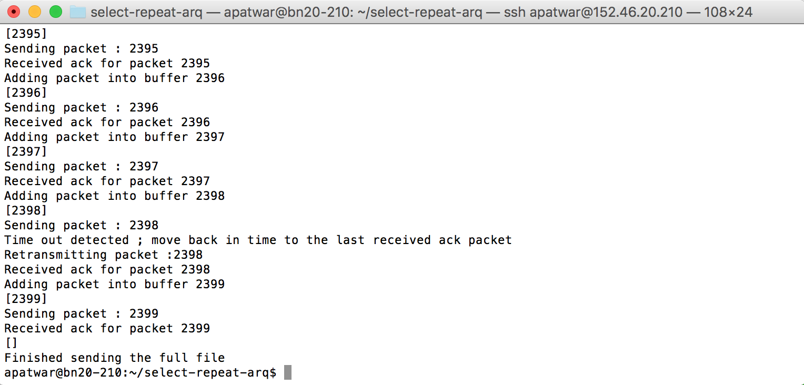

# Selective Repeat Project 

### Server

###### Initiate the server process as follows

```
python server.py SERVER_IP SERVER_PORT FILE_NAME PROBABILITY_VALUE WINDOW SIZE 
```
###### Put appropriate text/number in place of SERVER IP, SERVER PORT, FILE NAME, PROBABILITY VALUE, WINDOW SIZE
### Initiate the server process as follows

```
python client.py SERVER_IP SERVER_PORT FILE_TO_BE_SENT WINDOW_SIZE MSS CLIENT_IP
```
###### Put appropriate text/number in place of SERVER IP, SERVERPORT, FILE NAME, WINDOW SIZE, MSS , CLIENT IP

### Experiment 1 can be triggered using
```
./experiment1.sh
```
###### Enter the values for SERVER IP , SERVER PORT and CLIENT IP

### Experiment 2 can be triggered using
```
./experiment2.sh
```
###### Enter the values for SERVER IP , SERVER PORT and CLIENT IP

### Initiate the server process as follows

### Sample execution snapshot

#### server execution


#### peer execution


#### Final State
#### server execution


#### peer execution




